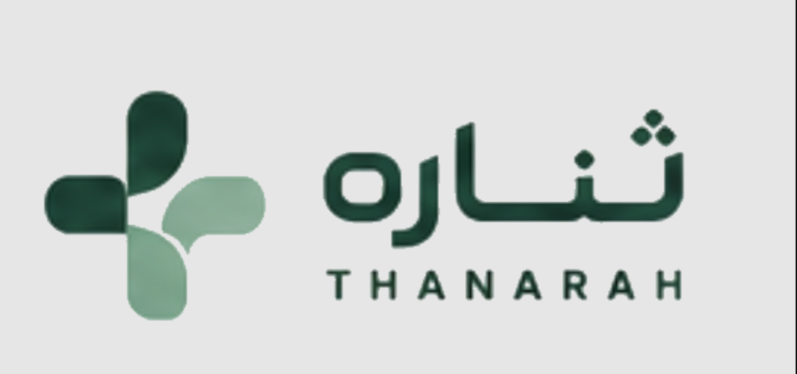

<div align="center">
  

  <br/>

  # ثناره — Thanarah Core Platform

  **منصة SaaS صحية للمؤسسات — Enterprise Healthcare SaaS**

  [](https://nestjs.com)
  [](https://fastify.dev)
  [](https://mongoosejs.com)
  [](https://www.typescriptlang.org)
  [](#)

</div>

---

## 🌿 من نحن — About Us

**ثناره** منصة رقمية متكاملة لإدارة المؤسسات الصحية، تجمع بين كفاءة العمليات وجودة تجربة المستخدم لخدمة مرافق الرعاية الصحية في المملكة العربية السعودية والمنطقة.

**Thanarah** is an enterprise-grade healthcare SaaS platform designed to unify clinical, operational, and administrative workflows for healthcare organizations across Saudi Arabia and the wider region. We combine cutting-edge technology with deep domain expertise to deliver a seamless experience for healthcare providers and patients alike.

---

## 🏗️ المكدس التقني — Tech Stack

| Layer | Technology |
|-------|-----------|
| **Runtime** | Node.js 20 LTS |
| **Framework** | NestJS 11 + Fastify |
| **Database** | MongoDB via Mongoose |
| **Language** | TypeScript 5 (strict) |
| **Validation** | Zod |
| **API Docs** | Swagger / OpenAPI |
| **Testing** | Vitest |

---

## 🚀 تشغيل المشروع — Getting Started

### المتطلبات — Prerequisites

- Node.js 20+
- MongoDB instance (local or Atlas)

### التثبيت — Installation

```bash
# Clone the repository
git clone https://github.com/thanarh/Thanarah-Core-Platform.git
cd Thanarah-Core-Platform

# Install dependencies
npm install

# Configure environment variables
cp .env.example .env
# Edit .env with your MONGO_URI and other secrets

# Build and run
npx nest build && node dist/main
```

### متغيرات البيئة — Environment Variables

| Variable | Description | Required |
|----------|-------------|----------|
| `MONGO_URI` | MongoDB connection string | ✅ |
| `SESSION_SECRET` | Session signing secret | ✅ |
| `JWT_SECRET` | JWT signing secret | ✅ |
| `PORT` | Server port (default: 5000) | — |
| `NODE_ENV` | `development` or `production` | — |

---

## 📁 هيكل المشروع — Project Structure

```
Thanarah-Core-Platform/
├── src/
│   ├── main.ts              # Entry point
│   ├── app.module.ts        # Root module
│   └── ...                  # Feature modules
├── public/
│   ├── index.html           # Coming Soon splash page
│   └── assets/              # Logo and static assets
├── test/                    # E2E tests
└── README.md
```

---

## 🗺️ خارطة الطريق — Roadmap

- [x] Project scaffold — NestJS + Fastify + MongoDB
- [x] Coming Soon splash page (Arabic typewriter effect)
- [ ] MongoDB integration — Mongoose schemas & connection
- [ ] Authentication module — JWT + sessions
- [ ] Login page — bilingual (AR/EN)
- [ ] Dashboard — multi-tenant healthcare management
- [ ] Role-based access control (RBAC)
- [ ] API documentation — Swagger

---

## 🤝 المساهمة — Contributing

هذا مستودع خاص. التطوير مقيّد على الفريق الأساسي.

This is a private repository. Contributions are restricted to the core team.

---

<div align="center">
  <sub>صُنع بعناية في المملكة العربية السعودية 🇸🇦 — Built with care in Saudi Arabia</sub>
</div>
